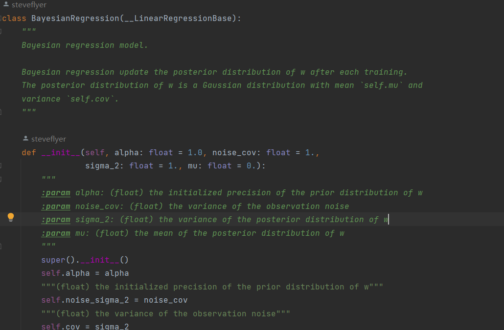
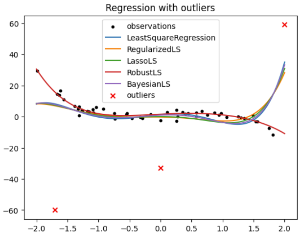

# implement_ml_with_steve

Welcome to steve's coding playground.

This is my implementation of fundamental machine learning algorithms mainly using `numpy` and a little bit `cvxpy` for solving optimization problem.

I try to make every implementation concise, well-commented, novice-friendly and in a unified manner. I really love well-commented code, since it can give you supreme experience when reading and trying to understand them, especially with IDE such as pycharm or vscode.

In my implementation, if you're confused by any variable or function, just hover on it and you'll find the documents are quite informative.

Hope you guys can play with these algorithms for fun.

The algorithms are written in python packages, and I will try to make some jupyter notebooks in a technical blog style for demonstrating them.
